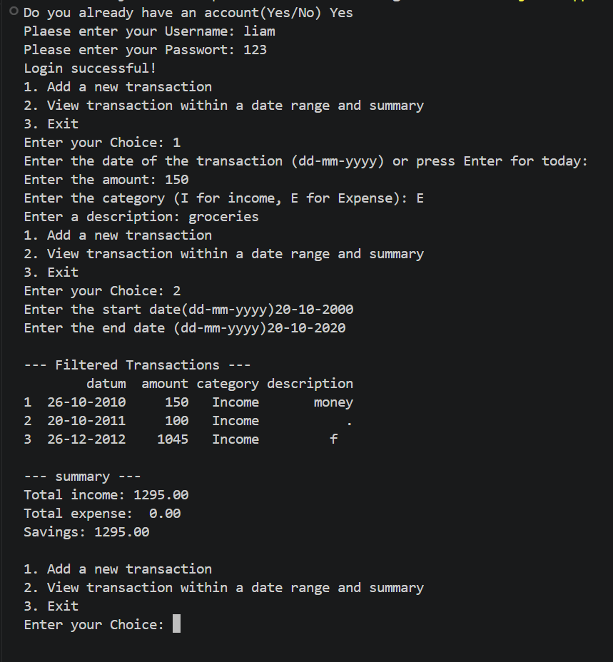

# Finance Manager

I made a Finance Manager in python which you can use in the command line for managing your personal finances

# Features

  

## Account creation

When you use it for the first time, you can crate a username and password which is locally stored in a json file that automatically gets created for you

## Add custom transaction 

You can add new income or expense with a date, amonut, category and custom description.

## Transaction date range

Another feature is transaction tracking with a custom date range, alongside a summary showing total income, total expenses, and savings. All transactions are continuously saved to finance_data.csv, which is automatically created for you

## Requirements

import json

import pandas as pd

import csv

from datetime import date

## How to install

just download the main.py file and all the requirements

